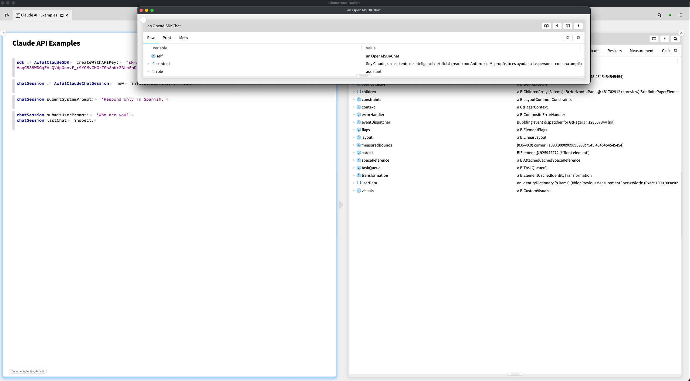

# AwfulOpenAI
API Client for OpenAI and Claude in Smalltalk. Quick and dirty implementation of text chat. We just subclass a few classes from the more complete [OpenAI-Pharo](https://github.com/brackendev/OpenAI-Pharo) and hack in a Claude implementation. 


## Installation
```st
Metacello new
	repository: 'github://graves/AwfulOpenAI:main/src';
	baseline: 'AwfulOpenAI';
	load
```

## Load Lepiter
After installing with Metacello, you will be able to execute
```
#BaselineOfAwfulOpenAI asClass loadLepiter
```
## Usage
```st
sdk := AwfulClaudeSDK createWithAPIKey: 'YOUR_API_KEY'.
chatSession := AwfulClaudeChatSession new initializeWithSDK: sdk.
chatSession submitSystemPrompt: 'Respond only in Spanish.'

chatSession submitUserPrompt: 'Who are you?'.
chatSession lastChat inspect.
```